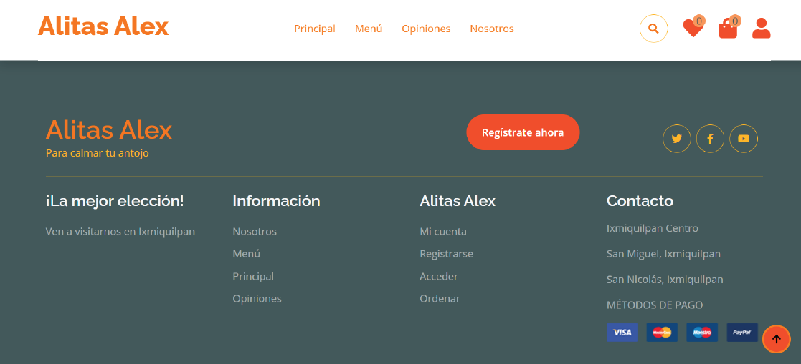
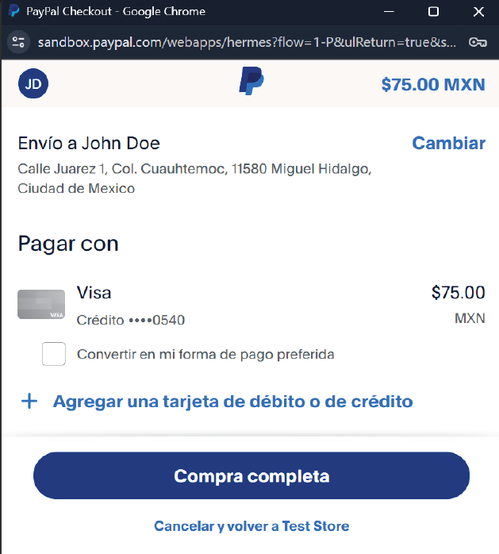

<h1>SOFTCKEN Project</h1>

<h2>Description</h2>

Softcken is a cross-platform web development project designed specifically for a local food business called 
<b>Alitas Alex</b> located in Ixmiquilpan, Hidalgo. The business has 5 branches, and this system facilitates 
online ordering for customers while providing a comprehensive administrative panel for staff management.

<h2>🔥 Features 🔥</h2>

<h3>Customer Panel</h3>
<ul>
  <li>User registration and login with email authentication.</li>
  <li>Browse the menu, add products to the cart, modify quantities, or remove items.</li>
  <li>Manage a list of favorite products for faster reordering.</li>
  <li>Secure online payments via <b>PayPal</b> and credit/debit cards.</li>
  <li>Order tracking with statuses: <i>In Process</i>, <i>Pending</i>, or <i>Completed</i>.</li>
  <li>Access and update user profile details.</li>
</ul>

<h3>Administrative Panel</h3>
<ul>
  <li>Manage all products, categories, and users through a complete CRUD system.</li>
  <li>Track and manage customer orders efficiently.</li>
  <li>Generate detailed reports in multiple formats: PDF, XLSX, CSV, or print directly.</li>
  <li>View dashboard with key business metrics and order statistics.</li>
</ul>

<h2>Customer Panel</h2>

These images show the customer interface, including browsing the menu, managing the cart, user profile, and payment process:

  
  
  
  
  
  
  
  
  

<h2>Administrative Panel</h2>

These images illustrate the admin panel, showing modules such as dashboard, users, categories, products, and orders:

  
  
  
  
  
  

<h2>Additional Functionalities</h2>
<ul>
  <li>Responsive design compatible with desktop, tablet, and mobile devices.</li>
  <li>Secure authentication and role-based access control for customers and administrators.</li>
  <li>Integration with external payment APIs for smooth transactions.</li>
  <li>Efficient order management with real-time status updates.</li>
  <li>Data export capabilities for business analysis and reporting.</li>
</ul>
